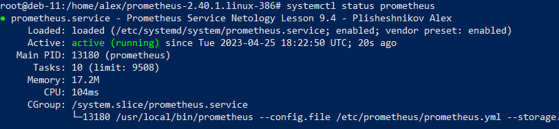
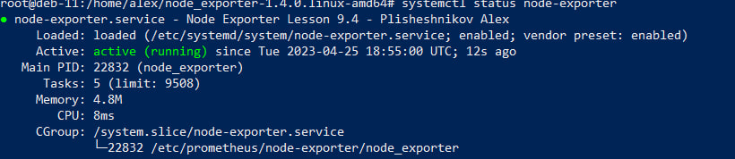
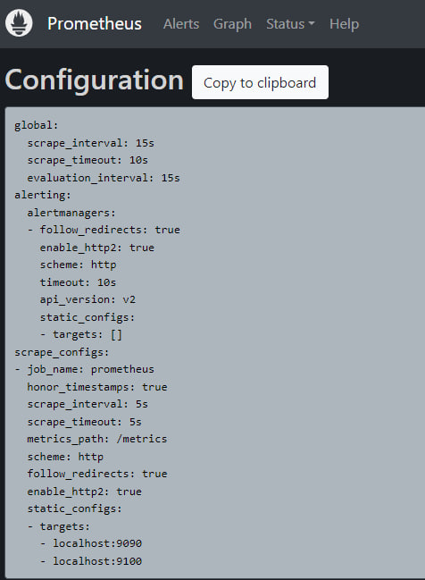
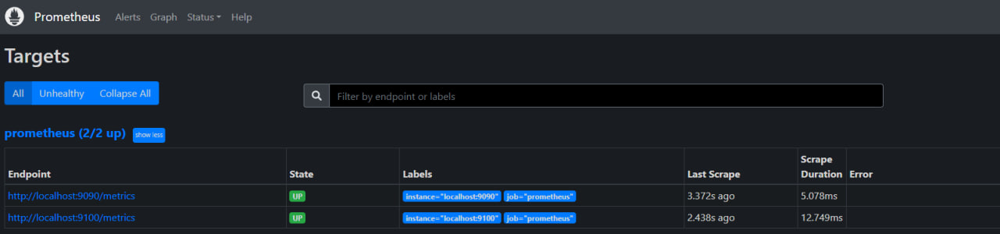

# Домашнее задание к занятию "Система мониторинга Prometheus" - Плишешников Алексей

### Задание 1

Установите Prometheus.

Прикрепите к файлу README.md скриншот systemctl status prometheus, где будет написано: prometheus.service — Prometheus Service Netology Lesson 9.4 — [Ваши ФИО]
 

---

### Задание 2

Установите Node Exporter

Прикрепите к файлу README.md скриншот systemctl status node-exporter, где будет написано: node-exporter.service — Node Exporter Netology Lesson 9.4 — [Ваши ФИО]

---

### Задание 3

Подключите Node Exporter к серверу Prometheus.

Прикрепите к файлу README.md скриншот конфигурации из интерфейса Prometheus вкладки Status > Configuration
Прикрепите к файлу README.md скриншот из интерфейса Prometheus вкладки Status > Targets, чтобы было видно минимум два эндпоинта

